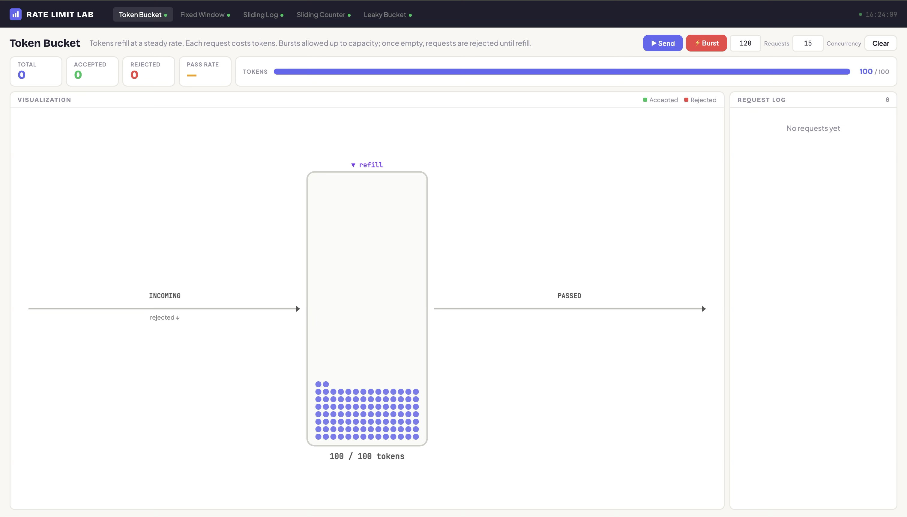

# Rate Limit Lab

An interactive dashboard for visualizing and comparing rate-limiting algorithms in real time.

## Algorithms

- **Fixed Window** — counts requests in fixed time intervals
- **Sliding Window Log** — tracks exact timestamps of each request
- **Sliding Window Counter** — weighted blend of current and previous window counts
- **Leaky Bucket** — requests drain at a constant rate from a queue
- **Token Bucket** — tokens refill at a steady rate; requests consume tokens

## Prerequisites

- [Node.js](https://nodejs.org/) (v18+)

## Getting Started

```bash
# Install dependencies
npm install

# Start the dev server
npm run dev
```

The dashboard will be available at **http://localhost:3456**.

## Project Structure

```
server.ts              → Express server with API routes for each algorithm
public/index.html      → Single-page dashboard UI
rate-limiters/
  token-buckets.ts     → Token Bucket implementation
  fixed-window.ts      → Fixed Window implementation
  sliding-log.ts       → Sliding Window Log implementation
  sliding-counter.ts   → Sliding Window Counter implementation
  leaky-bucket.ts      → Leaky Bucket implementation
  lru-map.ts           → LRU map used for per-IP state eviction
```

## API

Each algorithm exposes two endpoints:

| Endpoint | Description |
|---|---|
| `GET /api/<algorithm>/hit` | Send a request through the rate limiter |
| `GET /api/<algorithm>/status` | Check current rate-limit state without consuming a token |

Algorithm slugs: `token-bucket`, `fixed-window`, `sliding-window-log`, `sliding-window-counter`, `leaky-bucket`.
